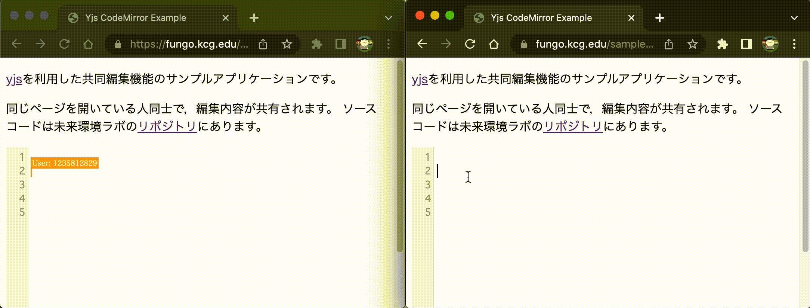

# sample-yjs

[yjs](https://github.com/yjs/yjs)を利用した共同編集のサンプルアプリです。[yjs-demos](https://github.com/yjs/yjs-demos)のcodemirrorサンプルのコードを独自にビルドしてcodemirror.bundle.jsを生成し、それを利用しています。

サーバは https://fungo.kcg.edu/yjs を利用しています。

yjsでは、[CRDT(Conflict-free Replicated Data Type)](https://www.researchgate.net/publication/310212186_Near_Real-Time_Peer-to-Peer_Shared_Editing_on_Extensible_Data_Types)という
データ共有技術が実装されています。


## 起動方法

まず、このリポジトリをcloneしてください。

```
git clone https://github.com/kcg-edu-future-lab/sample-yjs
```

次に、Python3を使ってwebサーバを立ち上げてください。

```
cd sample-yjs
python3 -m http.server
```

ブラウザで以下のURLにアクセスすると，共同編集のデモが表示されます。
同じタイミングで誰かがデモを表示していると，編集内容が共有されます。

* http://localhost:8000/


